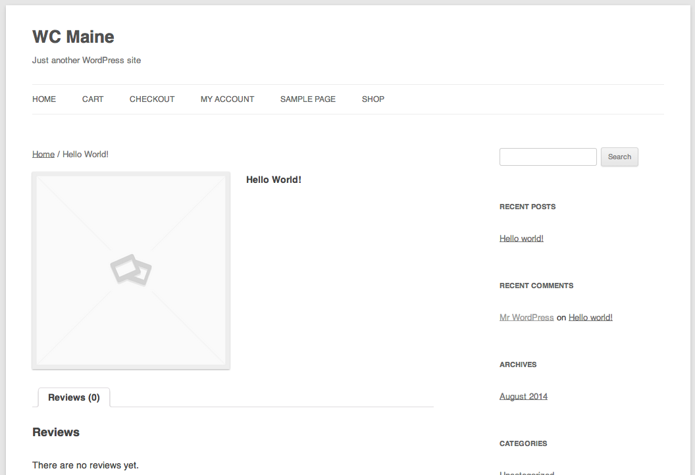

# Creating Your
# Online Store

### Patrick Rauland - @BFTrick

### Slides: TODO

---

## Tomorrow:

# Let’s Build an E-Commerce Store in 30 Minutes!

---

## Goal:

# Create an online store today - and start testing!

---

# [fit] WooCommerce

---

# Roadmap

* Installing WooCommerce
* Configuring WooCommerce
* Adding Products
* Configuring Payment
* Configuring Shipping
* Order Management
* Taxes

---

# [fit] Installing
# [fit] WooCommerce

---

# Installing WooCommerce - Hosting

* I'll be demoing on my local machine using MAMP
 * MAMP (for macs)
 * XAMP (macs & windows)
 * Desktop Server (macs & windows)
* You can do this locally or on a webserver

---

# Installing WooCommerce - Plugins

* WooCommerce

---

# Installing WooCommerce - Other Plugins You May Want

* WooCommerce Google Analytics Integration
* WooCommerce Pushover

---

# [fit] Configuring
# [fit] WooCommerce

---

## Configuring WooCommerce

# 1) - Activate the Plugin

---

---

## Configuring WooCommerce

# 2) - Click "Create Pages"

Creating the pages will automatically create the Shop, Cart, & Checkout page so you don't have to.

---

---

## Configuring WooCommerce

# 2) - Click "Create Pages"

If you ever need to recreate the pages you can do so under **WooCommerce -> System Status -> Tools -> Install WooCommerce Pages**.

---

---

## Configuring WooCommerce

# 3) Set your Store Location

Your store location is used for shipping calculations, taxes, and optionally restricting your store to certain countries

You can do this under **WooCommerce -> Settings -> Base Location**.

---

---

## Configuring WooCommerce

# 4) Set Available Countries

If this is your first store I highly suggest you start by only shipping to the US. Don't worry about international shipping until you get a request. Remember: it's much easier to build something simple today and update it tomorrow than to plan the perfect e-commerce site.

---

---

## Configuring WooCommerce

# 5) Set Currency

You can do this under **WooCommerce -> Settings -> Currency**.

Since you're in the US you don't need to worry about the other currency settings.

---

---

## Configuring WooCommerce

# 6) Don't Forget to Press *Save changes*

---

---

## Configuring WooCommerce

# 7) Tip: Always use a basic theme like *Twenty Twelve* when building your site.

Some themes override core WooCommerce functionality incorrectly and break things. It's best to use a simple theme for testing and then switch to a fancy theme once you're done.

---

---

# [fit] Adding
# [fit] Products

---

## Adding Products

# View All Products

You can view all products by clicking on **Products** in the WordPress menu.

---

---

## Adding Products

# Add a Product

You can view all products by clicking on **Products** in the WordPress menu.

---

---

## Adding Products

# Add a Title

The **only required field** is the **title field**.

Go ahead and enter Hello World! into the title field and press **Publish**.

---

---

---

## Adding Products

# Add a Basic Product Fields

* Price
* Image
* Description
* Short Description
* Product Categories / Tags

---

---

---

---

---

---

## Adding Products

# Virtual / Downloadable Products

Some products may be virtual (meaning nothing is shipped) or downloadable (meaning a file or multiple files will be downloaded after payment).

---

---

## Adding Products

# Virtual / Downloadable Product Fields

The **Sold Individually** setting under **Product Data -> Inventory -> Sold Individually** is useful for downloadable products since it doesn't make much sense to be able to buy two copies of a downloadable file.

---

---

## Adding Products

# Variable Products

The next big topic is variable products (think of a t-shirt with multiple sizes). Since there are so many options I'm going to cover it at the end.

In case we don't get to it here's an excellent video tutorial: http://docs.woothemes.com/document/product-variations/

---

## Payment

# Included Payment Methods

The included payment methods can be found under **WooCommerce -> Settings -> Checkout**.

---

## Payment

# Included Payment Methods

* BACS (Bank Transfer)
* Cheque (Don't blame me for the silly British spelling)
* Cash on Delivery
* Mijireh
* PayPal

---

## Payment

# Included Payment Methods - PayPal

PayPal allows users to pay via PayPal which goes into your PayPal balance.

---

## Payment

# Credit Cards

So this is the part that everyone's excited about right? We're going to jump into which gateways are best but before we get there we need to talk about **Merchant accounts**.

---

## Payment

# Credit Cards - Merchant Accounts

Merchant accounts are what traditional brick and mortar stores use to handle credit card transactions. Their POS systems validate the buyers card and the merchant account draws the funds. The funds sit there for a day or two and then they're deposited in to the bank account.

---

## Payment

# Credit Cards - Traditional Gateways

When the first e-commerce stores started coming online they needed a way to connect their store to their merchant account. Those systems that were invented at what we call **traditional payment gateways**.

---

## Payment

# Credit Cards - Traditional Gateways

Examples of traditional gateways are:

* Authorize.net

---

## Payment

# Credit Cards - Modern Gateways

Now that there are so many e-commerce stores that don't need a merchant account there are a lot of services that combine the merchant account and the payment gateway together. So they validate *and* draw the funds. These are called **modern payment gateways**.

---

## Payment

# Credit Cards - Modern Gateways

Examples of Modern Gateways are:

* Stripe
* Braintree
* Amazon Simple Pay

---

## Payment

# Credit Cards - Modern VS Traditional

Get a ton more information here: 

http://speakinginbytes.com/2014/08/merchant-account/

---

## Payment

# Credit Cards - Modern VS Traditional

* Modern is easier to setup & has a simple fee structure
* Modern gateways tend to hold onto funds longer (2-7 days instead of 1-2)

---

## Payment

# Credit Cards - Modern VS Traditional

* Modern is cheaper for < $8,000 / mo.
* Traditional is cheaper for > $8,000 / mo.

But those differences are changing *quickly*.

---

## Payment

# Credit Cards - Modern VS Traditional

So which do you use?

* If you have a merchant account -> traditional
* If you don't have a merchant account -> modern

---

## Payment

# Security Basics

If you're handling credit card numbers on your site you **need** a SSL certificate.

---

## Payment

# Security Basics

If you use a payment gateway that takes the user offsite you don't need a SSL certificate.

---

## Payment

# Security Basics - Offsite Gateways

I love offsite gateways. That way if you site gets hacked at least you aren't responsible for stolen credit card numbers.

---

---

## Payment

# Credit Cards - My Favs

* Traditional
 * Authorize.net (AIM)
* Modern
 * Amazon Simple Pay
 * Stripe

---

## Payment

# Credit Cards

Setting up a gateway can take a *while* so we're just going to use the offline gateways (Bank Transfer, Cheque, and Cash on Delivery).

---

# [fit] Time to do
# [fit] a test order!

---

## Shipping

# Included Shipping Methods

* Flat Rate
* Free
* International
* Local Delivery
* Local Pickup

---

## Shipping

# Flat Rate

The best place to start is Flat Rate because it's simple and configurable. You can find this under **WooCommerce -> Shipping -> Flat Rate**.

---

---

## Shipping

# Flat Rate

The most basic configuration is to set a cost per order. That's basically the base cost per order. You can add extra fees on top of it if you like.

---

---

## Shipping

# Flat Rate

Now if people buy 20 items you want to charge more for shipping right? That's when you want to add a per item charge in.

---

---

## Shipping

# Free Shipping

People *love* free shipping. I suggest that you have a minimum order amount to unlock free shipping becomes.

You can find this under **WooCommerce -> Shipping -> Free Shipping**

---

## Shipping

# Free Shipping

People *love* free shipping. You should definitely think about offering it as an incentive. I like to suggest that you have a minimum order amount and then free shipping becomes active.

---

---

# [fit] Time to do
# [fit] a test order!

---

## Order Management

You can find all of your orders under **WooCommerce -> Orders**.

You'll mostly want to look at **processing** orders, ship them, and mark them as **complete**.

---

---

## Order Management

You can change the status of orders from the Orders page.

---

---

## Order Management

You can also change it from the Order Detail page.

---

# [fit] Taxes - aka:
# [fit] Everyone's Favorite Part

---

## Taxes

# Configuring Taxes

Taxes can be configured in a ton of ways. In the US you're most likely to tax someone when they're in the same state as you.

This can be configured under **WooCommerce -> Settings -> Taxes**.

---

---

## Taxes

# Configuring Taxes

Now you need to set your standard rates.

---

---

## Taxes

# Configuring Taxes

Enter your state tax rate, and optionally add a tax rate for your city.

Make sure to set different priorities. Only one line item per rate per priority will be matched.

More info: http://docs.woothemes.com/document/setting-up-taxes-in-woocommerce/

---

---

## Taxes

# Configuring Taxes

ME - 5.5%

---

---

## Patrick Rauland - *@BFTrick*
### WooThemes

^ So that's me. I work for WooThemes and we make WooCommerce.
